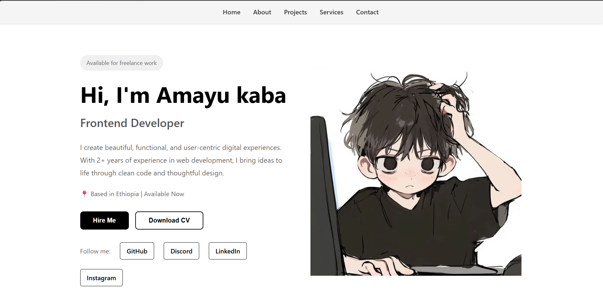

# Personal Landing Page

This is my first HTML and CSS project - a professional personal landing page showcasing my skills as a Frontend Developer.

## Project Description

A fully responsive landing page built with pure HTML and CSS. The page includes a navigation bar, hero section with profile information, call-to-action buttons, and social media links. The design is modern and clean, with a focus on user experience and responsive layout.

## Technologies Used

- **HTML5** - For semantic page structure
- **CSS3** - For styling and responsive design
- **Flexbox** - For flexible layouts
- **Media Queries** - For responsive design on different screen sizes

## Features

✅ Responsive Navigation Bar  
✅ Hero Section with Two-Column Layout  
✅ Styled Buttons  
✅ Social Media Links  
✅ Fully Responsive Design  
✅ Mobile-First Approach  
✅ Smooth Transitions and Hover Effects  

## File Structure

```
personal-landing-page/
├── index.html
├── style.css
├── image.png
├── screenshot.png
└── README.md
```

## Screenshot



## Responsive Design

- **Desktop**: Text content on the left, image on the right
- **Tablet**: Adjusted font sizes and spacing
- **Mobile**: Full-width stacked layout with centered content

## What I Learned

Through this project, I practiced and solidified my understanding of:

- **HTML Structure** - Creating semantic HTML with proper element hierarchy
- **CSS Flexbox** - Building flexible, responsive layouts without frameworks
- **Responsive Design** - Using media queries to create mobile-friendly experiences
- **Button Styling** - Creating attractive, interactive buttons with hover effects
- **Spacing** - Proper use of margin and padding for visual hierarchy
- **Typography** - Working with font sizes, weights, and line heights
- **Color Theory** - Creating a cohesive color scheme
- **Best Practices** - Clean code, proper indentation, and file organization

## How to Use

1. Clone or download this repository
2. Open `index.html` in your web browser
3. The page will automatically adapt to your screen size

## Customization

Feel free to customize:
- Replace the name and role with your information
- Update the description to match your experience
- Change the image by replacing `image.png`
- Modify colors in the CSS file
- Update social media links with your profiles

## Browser Support

This project works on all modern browsers:
- Chrome
- Firefox
- Safari
- Edge

## Future Enhancements

- Add JavaScript for interactive elements
- Implement smooth scrolling navigation
- Add more sections (Projects, Testimonials, etc.)
- Implement dark mode toggle
- Add animations

## Author

Divyansh Chaudhary - Frontend Developer

## License

This project is open source and available for educational purposes.

---

**Note**: This is a learning project created as part of the HTML and CSS training program.
