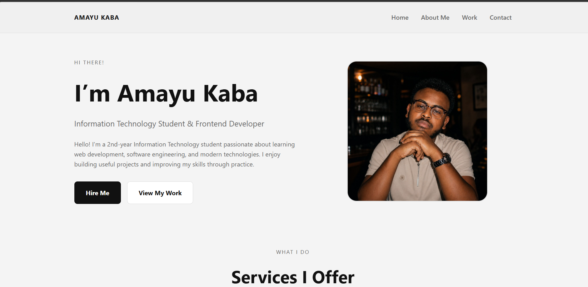

# Amayu Kaba Portfolio Website

A personal portfolio website built using HTML and CSS. It showcases my profile as a 2nd-year Information Technology student, including services, projects, skills, and contact links.

## Technologies Used
- HTML
- CSS

## Screenshot

## What I Learned
- Building layout with Flexbox and CSS Grid
- Responsive design using media queries
- Structuring a portfolio website with semantic HTML
- Creating hover interactions and clean visual design
